# Full-Stack Coding Assignment – HRMS Lite
**Done by:** Yatharth Chopra  
**Email:** 2301420022@krmu.edu.in  
**Contact:** 9810354459

> ⚠️ **Backend Notice:** The backend is hosted on a free tier on Render. It may take a few moments to reinitiate. Please be patient if you experience slight delays.

---

## 📋 Project Overview

**HRMS Lite** is a lightweight, production-ready Human Resource Management System that provides comprehensive employee and attendance management capabilities. Built with a modern full-stack architecture, it enables organizations to efficiently manage their workforce through an intuitive user interface backed by a robust REST API.

---

## 🚀 Tech Stack

### Frontend
- **Next.js 14** - React framework with App Router for server-side rendering and optimized performance
- **TypeScript** - Type-safe programming for better code quality
- **Tailwind CSS** - Utility-first CSS for responsive, modern UI design
- **Recharts** - Data visualization for analytics and trends
- **Three.js & React Three Fiber** - 3D graphics for interactive visual elements
- **Axios** - HTTP client for seamless API communication
- **Framer Motion** - Smooth animations and transitions
- **Lucide React** - Beautiful, consistent icon library

### Backend
- **FastAPI** - Modern, high-performance Python framework for building REST APIs
- **PostgreSQL** - Robust relational database via Supabase for data persistence
- **Pydantic** - Data validation and serialization with Python type hints
- **Uvicorn** - ASGI server for serving the FastAPI application
- **CORS Middleware** - Secure cross-origin resource sharing

### Database
- **Supabase PostgreSQL** - Managed PostgreSQL with Row Level Security and real-time capabilities

---

## 📊 Application Flow: Frontend → Backend → Database

```
┌─────────────────────────────────────────────────────────────────────────────┐
│                           FRONTEND (Next.js)                                 │
│  User interacts with React components: Forms, Tables, Dashboards, Charts    │
├──────────────────────────────────────────────────────────────────────────────┤
│                                    ↓                                          │
│  API Client (lib/api.ts) - Axios intercepts & Handles HTTP Requests/Responses│
│  Error Handling & Response Formatting                                        │
├──────────────────────────────────────────────────────────────────────────────┤
│                                    ↓                                          │
│        REST API Endpoints (FastAPI on Python Backend)                        │
│  Validates Data → Processes Logic → Queries Database                        │
├──────────────────────────────────────────────────────────────────────────────┤
│                                    ↓                                          │
│             Database (Supabase PostgreSQL)                                    │
│  Stores & Retrieves: Employees, Attendance Records, Analytics Data          │
└─────────────────────────────────────────────────────────────────────────────┘
```

---

## 🔧 Function Definitions & Architecture

### **BACKEND FUNCTIONS**

#### **1. Main Application Setup (main.py)**

| Function | Purpose |
|----------|---------|
| **lifespan()** | Context manager that initializes database connection on startup and closes it on shutdown |
| **validation_exception_handler()** | Catches and formats validation errors from Pydantic, returns detailed error messages to client |
| **general_exception_handler()** | Catches unexpected errors and returns proper HTTP error responses |
| **root()** | Health check endpoint that confirms API is running and lists available endpoints |
| **health_check()** | Tests database connectivity and returns system health status |

---

#### **2. Employee Management (routes/employees.py)**

| Function | Purpose |
|----------|---------|
| **create_employee()** | Creates a new employee record in the database with validation for unique employee_id and email |
| **get_all_employees()** | Retrieves all employees from database, ordered by creation date (newest first) |
| **get_employee()** | Fetches a specific employee by UUID; returns 404 if not found |
| **delete_employee()** | Removes an employee record from database; also deletes all associated attendance records (cascade) |

---

#### **3. Attendance Management (routes/attendance.py)**

| Function | Purpose |
|----------|---------|
| **mark_attendance()** | Records or updates attendance status (Present/Absent) for an employee on a specific date; prevents duplicate records |
| **get_attendance_records()** | Retrieves all attendance records with associated employee details (name, ID, department) |
| **filter_attendance()** | Filters attendance by multiple criteria: date range, employee ID, status, supporting advanced queries |

---

#### **4. Dashboard Analytics (routes/dashboard.py)**

| Function | Purpose |
|----------|---------|
| **get_dashboard_metrics()** | Aggregates key statistics: total employees, total attendance, today's present/absent counts, overall attendance rate, recent employees |

---

#### **5. Analytics & Trends (routes/analytics.py)**

| Function | Purpose |
|----------|---------|
| **get_attendance_trends()** | Calculates attendance patterns for the last 7 days, showing daily present/absent counts |
| **get_department_stats()** | Counts employees per department and ranks by count (useful for HR analysis) |
| **get_monthly_attendance()** | Groups attendance data by week within current month and calculates attendance rate per week |

---

### **FRONTEND FUNCTIONS**

#### **1. API Client (lib/api.ts)**

**Employee API Functions:**

| Function | Purpose |
|----------|---------|
| **employeeAPI.getAll()** | Fetches all employees from backend and returns as array |
| **employeeAPI.getById()** | Retrieves single employee data by UUID |
| **employeeAPI.create()** | Sends new employee form data to backend for creation |
| **employeeAPI.delete()** | Deletes an employee by ID |
| **employeeAPI.getAttendanceSummary()** | Gets attendance statistics for a specific employee |

**Attendance API Functions:**

| Function | Purpose |
|----------|---------|
| **attendanceAPI.getAll()** | Fetches all attendance records, optionally filtered by employee |
| **attendanceAPI.create()** | Marks attendance for an employee on a specific date |
| **attendanceAPI.update()** | Updates existing attendance record (e.g., change from Absent to Present) |
| **attendanceAPI.delete()** | Removes an attendance record |

**Dashboard & Analytics API Functions:**

| Function | Purpose |
|----------|---------|
| **dashboardAPI.getMetrics()** | Fetches dashboard summary statistics |
| **analyticsAPI.getTrends()** | Gets 7-day attendance trend data |
| **analyticsAPI.getDepartmentStats()** | Retrieves employee distribution by department |
| **analyticsAPI.getMonthlyAttendance()** | Gets weekly attendance rates for current month |

---

#### **2. React Components (UI Layer)**

| Component | Purpose |
|-----------|---------|
| **DashboardSummary** | Displays key metrics: total employees, attendance rate, today's stats in card layout |
| **EnhancedDashboard** | Advanced dashboard with charts, trends visualization, and department statistics |
| **EmployeeForm** | Form component for adding new employees with validation |
| **EmployeeTable** | Displays all employees in table format with delete functionality |
| **AttendanceForm** | Interface to mark attendance with date picker and status selector |
| **AttendanceTable** | Lists attendance records with employee details, filterable by multiple criteria |
| **AttendanceFilter** | Advanced filter panel for date range, employee, and status filtering |
| **LoadingState** | Loading skeleton/spinner shown during data fetch operations |
| **ErrorState** | Error message display when API calls fail |
| **EmptyState** | Friendly message when no data matches the filter criteria |

---

## 📊 Complete Application Flow Diagram

```mermaid
graph TD
    A["👤 User Opens HRMS Lite"] --> B["🎨 Next.js Frontend Loads"]
    B --> C{User Action}
    
    C -->|View Dashboard| D["DashboardSummary Component"]
    C -->|Manage Employees| E["EmployeeForm & EmployeeTable"]
    C -->|Track Attendance| F["AttendanceForm & AttendanceTable"]
    C -->|View Analytics| G["EnhancedDashboard with Charts"]
    
    D --> D1["Calls dashboardAPI.getMetrics()"]
    E --> E1["Calls employeeAPI.getAll/create/delete()"]
    F --> F1["Calls attendanceAPI.create/getAll()"]
    G --> G1["Calls analyticsAPI.getTrends()"]
    
    D1 --> H["📡 Axios HTTP Request<br/>GET /api/dashboard"]
    E1 --> H
    F1 --> H
    G1 --> H
    
    H --> I["FastAPI Backend Receives Request"]
    I --> J{Route Handler}
    
    J -->|GET /api/dashboard| K["get_dashboard_metrics()"]
    J -->|POST /api/employees| L["create_employee()"]
    J -->|GET /api/employees| M["get_all_employees()"]
    J -->|DELETE /api/employees/:id| N["delete_employee()"]
    J -->|POST /api/attendance| O["mark_attendance()"]
    J -->|GET /api/attendance| P["get_attendance_records()"]
    J -->|GET /api/analytics/attendance-trends| Q["get_attendance_trends()"]
    
    K --> K1["Validate Input with Pydantic"]
    L --> L1["Validate Input with Pydantic"]
    O --> O1["Validate Input with Pydantic"]
    Q --> Q1["Validate Input with Pydantic"]
    
    K1 --> R["🗄️ Query Supabase PostgreSQL"]
    L1 --> R
    O1 --> R
    Q1 --> R
    
    R --> R1["Execute SQL Queries"]
    R1 --> S["Aggregate Data & Calculate Metrics"]
    S --> T["Format Response as JSON"]
    
    T --> U["⬆️ HTTP Response 200 OK<br/>Return JSON Data"]
    U --> V["Frontend Receives Response"]
    V --> W["Axios Response Interceptor<br/>Error Handling"]
    W --> X["Update React State<br/>Re-render Components"]
    X --> Y["🎉 Display Data to User<br/>Tables, Charts, Forms Updated"]
    
    style A fill:#FFE5B4
    style B fill:#87CEEB
    style I fill:#FFB6C1
    style R fill:#98FB98
    style Y fill:#DDA0DD
```



---

## 📚 Core Features

### ✅ **Employee Management**
- Add new employees with Employee ID, Name, Email, and Department
- View all employees in a responsive table format
- Delete employees and their associated attendance records
- Unique constraints on Employee ID and Email to prevent duplicates

### ✅ **Attendance Tracking**
- Mark daily attendance as Present or Absent
- Update attendance records if needed
- View attendance history with employee details
- Prevent duplicate attendance for same employee on same day

### ✅ **Advanced Analytics**
- **7-Day Trends**: Visualize attendance patterns over the last week
- **Department Statistics**: See employee distribution across departments
- **Monthly Breakdown**: Weekly attendance rates for current month
- **Overall Metrics**: Attendance rate percentage, total present/absent days
- **Real-time Dashboard**: Today's attendance summary

### ✅ **Filtering & Search**
- Filter attendance by single date or date range
- Filter by employee ID
- Filter by attendance status (Present/Absent)
- Combine multiple filters for precise data retrieval

### ✅ **Dashboard & Insights**
- Total employee count in organization
- Overall attendance rate calculation
- Today's attendance statistics (Present/Absent)
- Recent employees list
- Interactive charts and visualizations

---

## 🗄️ Database Schema

### **Employees Table**
```sql
id (UUID, Primary Key)
employee_id (TEXT, Unique) → e.g., "EMP001", "E-2024-001"
full_name (TEXT) → Employee's full name
email (TEXT, Unique) → Corporate email address
department (TEXT) → Department assignment
created_at (TIMESTAMP) → Record creation time
updated_at (TIMESTAMP) → Last modification time
```

### **Attendance Table**
```sql
id (UUID, Primary Key)
employee_id (UUID, Foreign Key → employees.id) → Link to employee
attendance_date (DATE) → Date of attendance record
status (ENUM: 'present' | 'absent') → Attendance status
created_at (TIMESTAMP) → Record creation time

UNIQUE CONSTRAINT: (employee_id, attendance_date) 
→ Ensures one record per employee per day
```

---

## 🛠️ Local Development Setup

### Prerequisites
- **Node.js** 18+ and npm/pnpm/yarn
- **Python** 3.10+
- **Supabase** account with PostgreSQL database
- **Git** for version control

### **Backend Setup**

1. **Navigate to backend directory:**
   ```bash
   cd backend
   ```

2. **Create virtual environment:**
   ```bash
   python -m venv venv
   source venv/bin/activate  # On Windows: venv\Scripts\activate
   ```

3. **Install dependencies:**
   ```bash
   pip install -r requirements.txt
   ```

4. **Setup environment variables:**
   Create a `.env` file in the backend directory with:
   ```env
   SUPABASE_URL=<your_supabase_url>
   SUPABASE_KEY=<your_supabase_key>
   CORS_ORIGINS=["http://localhost:3000","http://localhost:8000"]
   HOST=0.0.0.0
   PORT=8000
   ```

5. **Run the backend:**
   ```bash
   python main.py
   # API available at http://localhost:8000
   # API Docs available at http://localhost:8000/docs
   ```

### **Frontend Setup**

1. **Navigate to frontend directory:**
   ```bash
   cd frontend
   ```

2. **Install dependencies:**
   ```bash
   npm install
   # or
   pnpm install
   ```

3. **Setup environment variables:**
   Create a `.env.local` file with:
   ```env
   NEXT_PUBLIC_API_URL=http://localhost:8000
   NEXT_PUBLIC_SUPABASE_URL=<your_supabase_url>
   NEXT_PUBLIC_SUPABASE_ANON_KEY=<your_supabase_key>
   ```

4. **Run the development server:**
   ```bash
   npm run dev
   # Application available at http://localhost:3000
   ```

### **Database Setup**

1. Create a Supabase project at [supabase.com](https://supabase.com)
2. Run the schema.sql file in Supabase SQL Editor to create tables
3. Configure Row Level Security (RLS) policies as needed
4. Update `.env` files with your Supabase credentials

---

## 📡 API Endpoints Summary

### **Employee Endpoints**
- `POST /api/employees` - Create new employee
- `GET /api/employees` - Get all employees
- `GET /api/employees/{id}` - Get employee by ID
- `DELETE /api/employees/{id}` - Delete employee

### **Attendance Endpoints**
- `POST /api/attendance` - Mark attendance
- `GET /api/attendance` - Get all attendance records
- `GET /api/attendance/filter` - Filter attendance by criteria
- `PUT /api/attendance/{id}` - Update attendance
- `DELETE /api/attendance/{id}` - Delete attendance record

### **Dashboard Endpoints**
- `GET /api/dashboard` - Get dashboard metrics

### **Analytics Endpoints**
- `GET /api/analytics/attendance-trends` - 7-day trends
- `GET /api/analytics/department-stats` - Department statistics
- `GET /api/analytics/monthly-attendance` - Monthly attendance breakdown

### **Health Endpoints**
- `GET /` - API info
- `GET /health` - Health check

---

## 🔒 Data Validation & Security

### **Input Validation**
- Pydantic models validate all incoming data
- Email format validation using EmailStr
- Employee ID format validation (alphanumeric, dash, underscore only)
- Unique constraints on email and employee_id fields
- Required field validation

### **Error Handling**
- Structured error responses with HTTP status codes
- Validation error details returned to client
- Database constraint violations provide meaningful error messages
- Connection failure gracefully handled

---

## 📈 Performance Considerations

- Async/await for non-blocking database operations
- Response caching on frontend for frequently accessed data
- Indexed database queries for fast retrieval
- Lazy loading of components in Next.js
- Efficient data aggregation at database level

---

## 🎯 Future Enhancement Possibilities

- User authentication and role-based access control
- Email notifications for attendance updates
- Bulk attendance import from CSV
- Salary and payroll integration
- Leave management module
- Performance reviews module
- Mobile app using React Native
- Advanced reporting and export functionality

---

## 📝 Project Structure

```
HRMS/
├── backend/
│   ├── main.py                 # FastAPI application entry point
│   ├── config.py               # Configuration & environment variables
│   ├── requirements.txt         # Python dependencies
│   ├── database/
│   │   └── connection.py        # Supabase connection logic
│   ├── models/
│   │   └── schemas.py          # Pydantic data models
│   └── routes/
│       ├── employees.py        # Employee CRUD operations
│       ├── attendance.py       # Attendance management
│       ├── dashboard.py        # Dashboard metrics
│       └── analytics.py        # Analytics & trends
│
├── frontend/
│   ├── package.json            # Node dependencies
│   ├── tsconfig.json          # TypeScript configuration
│   ├── tailwind.config.js     # Tailwind CSS config
│   ├── app/
│   │   ├── layout.tsx         # Root layout component
│   │   ├── page.tsx           # Home page
│   │   └── dashboard/
│   │       └── page.tsx       # Dashboard page
│   ├── components/
│   │   ├── employees/         # Employee-related components
│   │   ├── attendance/        # Attendance-related components
│   │   ├── dashboard/         # Dashboard components
│   │   └── ui/                # Reusable UI components
│   └── lib/
│       └── api.ts             # API client functions
│
├── database/
│   ├── schema.sql             # Database schema definitions
│   └── sample_data.sql        # Sample data for testing
│
└── README.md                   # This file
```

---

## 🤝 Support & Troubleshooting

### **Backend Issues**
- **Slow Response?** Backend is on free tier on Render - please wait for reinitiation
- **API not responding?** Check that the backend is running: Visit `http://localhost:8000/health`
- **Database connection error?** Verify Supabase credentials in `.env`

### **Frontend Issues**
- **API calls failing?** Check `NEXT_PUBLIC_API_URL` is correct
- **Styles not loading?** Run `npm install` to ensure Tailwind CSS is properly installed
- **Components not rendering?** Check browser console for errors

---

## ✨ Technical Highlights

### **What Makes This HRMS Lite?**
- ✅ Focused on core HR functions: Employees & Attendance
- ✅ Lightweight dependencies, easy to extend
- ✅ No authentication overhead (can be added)
- ✅ Minimal third-party integrations
- ✅ Clean, readable, well-documented code

### **What Makes This Production-Ready?**
- ✅ Proper error handling and validation
- ✅ Structured response formats
- ✅ Database constraints and referential integrity
- ✅ CORS enabled for secure API access
- ✅ Modular architecture for easy maintenance
- ✅ Type safety with TypeScript and Pydantic

---

## 📄 License & Credits

Created as a Full-Stack Coding Assignment demonstrating modern web development practices combining React, Next.js, FastAPI, and PostgreSQL.

---

**Last Updated:** February 2026  
**Status:** ✅ Production Ready
   
   Update with your Supabase credentials:
   ```
   DATABASE_URL=postgresql://[USER]:[PASSWORD]@[HOST]:[PORT]/[DATABASE]
   SUPABASE_URL=https://xxxxx.supabase.co
   SUPABASE_KEY=your-supabase-anon-key
   ```

5. **Run database migrations:**
   - Go to Supabase SQL Editor
   - Run the migration script from `database/schema.sql`

6. **Start the server:**
   ```bash
   uvicorn main:app --reload --host 0.0.0.0 --port 8000
   ```

   API will be available at `http://localhost:8000`

### Frontend Setup

1. **Navigate to frontend directory:**
   ```bash
   cd frontend
   ```

2. **Install dependencies:**
   ```bash
   npm install
   # or
   yarn install
   ```

3. **Create `.env.local` file:**
   ```bash
   cp .env.example .env.local
   ```
   
   Update with your backend URL:
   ```
   NEXT_PUBLIC_API_URL=http://localhost:8000
   ```

4. **Start development server:**
   ```bash
   npm run dev
   # or
   yarn dev
   ```

   Frontend will be available at `http://localhost:3000`

## 🌐 Deployment

### Backend Deployment (Render/Railway)

1. **Create new Web Service**
2. **Connect GitHub repository**
3. **Configure:**
   - Build Command: `pip install -r requirements.txt`
   - Start Command: `uvicorn main:app --host 0.0.0.0 --port $PORT`
   - Add environment variables from `.env.example`

### Frontend Deployment (Vercel)

1. **Connect GitHub repository to Vercel**
2. **Configure:**
   - Framework Preset: Next.js
   - Root Directory: `frontend`
   - Add environment variable: `NEXT_PUBLIC_API_URL=[Your Backend URL]`
3. **Deploy**

## 📡 API Documentation

### Employee Endpoints

#### Create Employee
```
POST /api/employees
Body: {
  "employee_id": "EMP001",
  "full_name": "John Doe",
  "email": "john@example.com",
  "department": "Engineering"
}
```

#### Get All Employees
```
GET /api/employees
```

#### Delete Employee
```
DELETE /api/employees/{employee_id}
```

### Attendance Endpoints

#### Mark Attendance
```
POST /api/attendance
Body: {
  "employee_id": "uuid",
  "attendance_date": "2026-02-06",
  "status": "present"
}
```

#### Get Attendance Records
```
GET /api/attendance?employee_id={uuid}
```

#### Filter Attendance
```
GET /api/attendance/filter?date=2026-02-06
GET /api/attendance/filter?start_date=2026-02-01&end_date=2026-02-07
```

#### Get Attendance Summary
```
GET /api/employees/{employee_id}/attendance-summary
```

#### Get Dashboard Metrics
```
GET /api/dashboard
```

## 🎯 Assumptions & Limitations

### Assumptions
- Single admin user (no authentication required as per requirements)
- Attendance can only be marked once per employee per day
- Employee ID must be unique and immutable
- Departments are free-text fields (no predefined list)
- All dates are in ISO 8601 format (YYYY-MM-DD)

### Limitations
- No user authentication/authorization
- No payroll management
- No leave management
- No employee profile photos
- No bulk operations (import/export)
- No email notifications
- No audit logs

### Out of Scope (As per requirements)
- Leave management
- Payroll processing
- Advanced HR features
- Multi-tenancy
- Role-based access control

## 🧪 Testing

Run backend tests:
```bash
cd backend
pytest
```

## 📝 Project Structure

```
HRMS/
├── frontend/
│   ├── app/
│   │   ├── page.tsx (Three.js Homepage)
│   │   └── dashboard/
│   │       └── page.tsx
│   ├── components/
│   │   ├── employees/
│   │   ├── attendance/
│   │   ├── dashboard/
│   │   └── ui/
│   ├── lib/
│   │   └── api.ts
│   └── package.json
├── backend/
│   ├── main.py
│   ├── models/
│   ├── routes/
│   ├── database/
│   ├── requirements.txt
│   └── .env.example
├── database/
│   └── schema.sql
├── .gitignore
└── README.md
```

## 🔒 Security Notes

- CORS is currently set to allow all origins for development
- For production, restrict CORS to specific frontend domain
- Use environment variables for all sensitive credentials
- Enable RLS policies on Supabase for additional security

## 📄 License

This project is created as part of a coding assignment.

## 🤝 Contributing

This is an assignment project. No contributions accepted.

---

**Live Demo:** [To be added after deployment]

**Repository:** [To be added]
